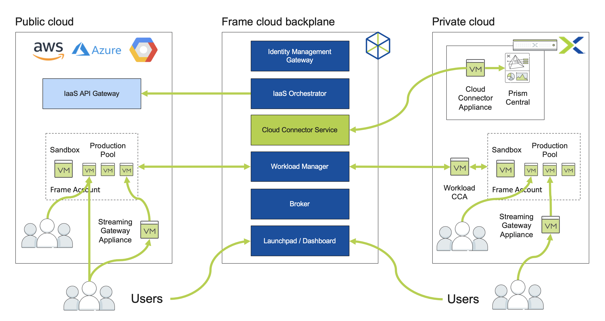

.. _deploycca:

--------------------------------------------
Deploying Xi Frame Cloud Connector Appliance
--------------------------------------------

While the Frame control plane is fully cloud-hosted, running on-premises desktops require proxy VMs, as shown in the diagram below.

An on-premises virtual Cloud Connector Appliance (CCA), enables the cloud-hosted Frame Platform service to communicate with the on-premises Prism Central API. The CCA forwards commands to create, start, stop, and delete VMs to Prism Central, based on requests from the Frame Platform. The CCA appliance must be on the same VLAN as Prism Central.

After the initial configuration following the CCA wizard deployment, and upon successful registration of the AHV Cloud Account to the Frame Platform, a second virtual appliance is automatically created. This second appliance is the Workload Cloud Connector Appliance (WCCA, also known as the Workload Proxy in Prism). The WCCA allows for Frame Platform to send orchestration information to all user workload VMs (Sandbox, Production instances, and Utility Servers). Without this appliance, end users will not be able to connect to the workload VMs.

**In this lab you will deploy the Frame Cloud Connector Appliance and configure the connection between your cluster and the Frame control plane.**

.. note::

   The Frame Cloud Connector creation process is 100% automated starting with the release of Prism Central 5.11.1 via the Settings menu. For the purposes of this lab, you will follow the manual procedure below for deploying and configuring the appliance VM.

Creating a Frame Account
++++++++++++++++++++++++

In this exercise we'll take advantage of the Xi Frame trial offering, using your My Nutanix credentials.

   .. note::

      If you've previously used the Frame trial, inform a proctor so your account can be reset.

#. In a browser, log into https://my.nutanix.com with your My Nutanix credentials.

#. Under **Xi Cloud Services > Xi Frame**, click **Start Trial**.

   .. figure:: images/0a.png

   .. note::

     If you have already started a trial, click **Launch**

#. Provide the additional requested information and click **Continue** to activate your 30 day trial.

#. When prompted with multiple trial options, click **Start your 30 day free trial**. This will allow you to provide your own infrastructure to host desktops for up to 5 named users for a 30 day period.

   .. figure:: images/0b.png

#. You will be taken to the Frame Account Administration portal. Select **Organizations** from the left hand menu and click **Add Organization**. Specify a name and save.

   .. figure:: images/0c.png

   .. note::

      Frame Platform uses a 3-tiered hierarchy for organizing administration, cloud resources, and access to accounts.

      **Customers**

         The Customers tier is the highest tier within the Frame platform. This is essentially the “Master Account” for a single business entity with a billing relationship with Nutanix. By following the Free Trial workflow, you have created your own Customer entity.

      **Organizations**

         The Organizations tier is the second highest tier within the Frame platform. There can be many organizations listed under one Customer depending on the use case. A business may use organizations to set up unique environments for different departments within their company. For the purposes of this lab, you will create one Organization entity which will map to your AHV cluster resources and hold your first Frame account.

      **Accounts**

         This is where an administrator will manage their gold master image, install and manage their applications, and configure their production VMs. This is also where administrators will create Launchpads for their end users. When an end user logs into Frame, they are accessing one of the Launchpads associated to one of the accounts listed under an Organization in order to reach their workload VMs.

Adding Prism Service Account
++++++++++++++++++++++++++++

#. In **Prism Central**, select :fa:`bars` **> Prism Central Settings > Local User Management**.

#. Create a new service account for the Frame CCA but filling out the following fields and clicking **Save**:

   - **Username** - *Initials*\ -FrameSvc
   - **First Name** - *Initials* Frame
   - **Last Name** - Service Account
   - **Email** - (Any e-mail address)
   - **Password** - nutanix/4u
   - Under **Roles**, select **User Admin** and **Prism Central Admin**

   .. figure:: images/1.png

Adding Frame Category
+++++++++++++++++++++

Frame uses Prism Central Categories to allow the Cloud Connector Appliance to identify the template images that will be used to create the Frame account Sandboxes and desktop VMs.

.. note::

   Creation of the category and values only needs to occur once per Prism Central instance, but the category values will need to be assigned to the appropriate VMs for all subsequent lab completions.

#. In **Prism Central**, select :fa:`bars` **> Virtual Infrastructure > Categories**.

   .. figure:: images/2.png

#. Review the available categories. If **FrameRole** doesn't already exist, click **New Category** and fill out the following fields:

   - **Name** - FrameRole
   - **Purpose** - Allowing resource access based on Application Team
   - **Values**

      - Instance
      - Template
      - MasterTemplate

   .. note::

      Use the :fa:`plus` button to add additional values.

   .. figure:: images/2b.png

#. Click **Save**.

#. In **Prism Central**, select :fa:`bars` **> Virtual Infrastructure > VMs** and select your *Initials*\ **-GoldImage** VM.

#. Select **Actions > Manage Categories** and add the **FrameRole:MasterTemplate** value to the VM. The Frame CCA will later search for VMs with this category value. Click **Save**.

   .. figure:: images/2c.png

Creating the CCA VM
+++++++++++++++++++

The CCA is distributed as a bootable ISO image, not a disk image.

#. In **Prism Central**, select :fa:`bars` **> Virtual Infrastructure > VMs**.

#. Click **Create VM**.

#. Select your assigned cluster and click **OK**.

#. Fill out the following fields:

   - **Name** - *Initials*-FrameCCA
   - **Description** - (Optional) Description for your VM.
   - **vCPU(s)** - 1
   - **Number of Cores per vCPU** - 2
   - **Memory** - 4 GiB

   - Beside **Disks > CD-ROM**, select :fa:`pencil`
      - **Operation** - Clone from Image Service
      - **Image** - FrameCCA-2.1.6.iso
      - Select **Update**

   - Select **+ Add New Disk**
      - **Type** - DISK
      - **Operation** - Allocate on Storage Container
      - **Storage Container** - Default
      - **Size** - 0.1 GiB
      - Select **Add**

   - Select **Add New NIC**
      - **VLAN Name** - Primary
      - Select **Add**

#. Click **Save** to create the VM.

#. Select your VM and click **Actions > Power On**.

   .. note::

      By default, the CCA will try to acquire an IP address from a DHCP server. If you wish to set a static IP, use the console to access the CCA VM.

Configuring the CCA
+++++++++++++++++++

#. Note the **IP Address** of the *Initials*\ **-FrameCCA** VM in Prism, and open a new browser tab to \http://<*CCA-IP*>/ to access the **Cloud Connector Configuration** wizard.

   .. figure:: images/3.png

   .. note::

      Make sure you are using the same browser session as above. my.nutanix.com will look for the cookie.

#. Fill in the following fields and click **Log In** to connect the CCA to your Nutanix environment:

   - **Username** - Previously created *Initials*\ -FramceSvc account
   - **Password** - nutanix/4u
   - **Prism Central URL** - \https://<*Prism Central IP*>:9440

   .. figure:: images/4.png

#. Under **Select Cluster**, fill in the following fields and click **Next**:

   - **Cluster for virtual desktops** - *Your assigned cluster*
   - **Network for virtual desktops** - Primary
   - **Cloud account name** - *Initials*\ -\ *Cluster-Name*

   .. figure:: images/5b.png

   .. note::

      You do not need to select **Enable enterprise profiles and personal drives** as this feature will not be used in the following exercises.

#. Under **Define Instance Types**, edit the existing profile name to **AHV 2vCPU 4GB** to better reflect the configuration. Add an additional custom **Instance Type**. Click **Next**.

   An Instance Type is the VM configuration which will be launched to run applications. In public cloud environments, these map to that cloud providers available instance types (e.g. AWS t.2large).

   .. figure:: images/6.png

#. Under **Select Sandbox Templates**, your *Initials*\ **-GoldImage** VM should automatically appear based on the **MasterTemplate** category value previously applied. Select the VM and specify **Windows 10** from the **OS** drop down. Click **Next**.

   .. figure:: images/7.png

#. The final step is to link your local infrastructure to the hosted Frame backplane. Under **Connect to Frame**, select **Sign in with My Nutanix** and provide your My Nutanix credentials if prompted. Once logged in, select the pre-created **nutanix.com Customer** and click **Finish**.

   .. figure:: images/8.png

   .. note::

      At this time, you cannot make any configuration changes to the Cloud Connector Appliance after it has been connected to the cluster. This functionality is being introduced in an upcoming release.

#. Click **Go to Frame** to be redirected to the Xi Frame portal. Select **Organizations** from the left hand menu, and click :fa:`ellipsis-v` **> Cloud Accounts** to view the AHV Cloud Account creation status.

   .. figure:: images/9.png

   .. note::

      Click **Add Cloud Account** to see the wizard one would follow to add additional AWS, Azure, and GCP resources, all capable of being managed from the same Xi Frame portal.

   The **C** status indicates that the account is still being created. Prism Central will provision a Workload Proxy VM (**frame-workload-proxy-####**) in the desktop VLAN specified during CCA configuration. Once the status changes to **R**, indicating the workload proxy has been successfully provisioned, continue to the next exercise.

   .. figure:: images/10.png

   .. note::

      You may need to refresh your browser.

   You're now ready to begin provisioning AHV hosted desktops with Frame!
