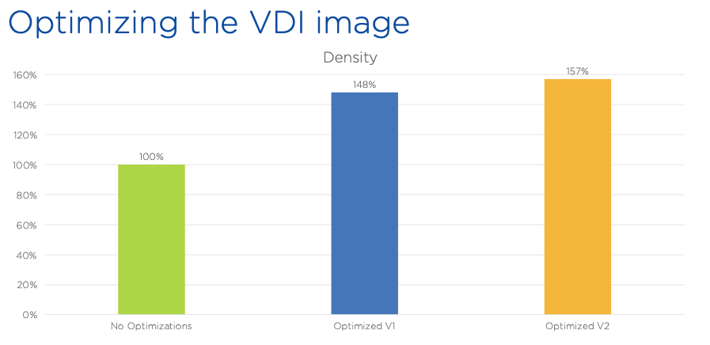

.. _framegoldimage:

------------------------------------
Building & Optimizing the Gold Image
------------------------------------

When we install a vanilla client operating system, we need to keep in mind that this OS was built for physical devices (i.e. laptops and desktops), with direct attached devices and limited noisy neighbor effects. If we install that same OS in a VM we might see different results, hence the need for optimization. The Nutanix Performance/Solutions Engineering team for EUC has tested various optimizations and the lab, and validated the following results:

As you can see there’s a 48% improvement of desktop density per node when applying baseline Citrix optimizations, and increases to 57% with a second pass using VMware OS optimization recommendations. Note that both sets of optimizations are independent of underlying hypervisor, and rather tune services within the OS guest.

**In this lab you will install the Frame Agent within a VM, and optimize the VM using the Citrix Optimizer.**

Deploying a VM
++++++++++++++

#. In **Prism Central**, select :fa:`bars` **> Virtual Infrastructure > VMs**.

   .. figure:: images/1.png

#. Click **Create VM**.

#. Select your assigned cluster and click **OK**.

#. Fill out the following fields:

   - **Name** - *Initials*\ -GoldImage
   - **Description** - (Optional) Description for your VM.
   - **vCPU(s)** - 2
   - **Number of Cores per vCPU** - 1
   - **Memory** - 4 GiB

   - Select **+ Add New Disk**
       - **Type** - DISK
       - **Operation** - Clone from Image Service
       - **Image** - Win10v1903.qcow2
       - Select **Add**

   - Select **Add New NIC**
       - **VLAN Name** - Primary
       - Select **Add**

#. Click **Save** to create the VM.

#. Select your VM and click **Power On**.

.. _FramePausingUpdates:

Pausing Updates
+++++++++++++++

Before starting to build your **Windows 10** image it is important the ensure that no Windows Updates are in progress, as this can cause issues with cloning.

#. Open the VM console or connect via RDP.

   - **User Name** - Nutanix
   - **Password** - nutanix/4u

#. Open **Start > Settings > Updates & Security > Windows Update** and click **Pause Updates for 7 Days**.

   .. figure:: images/24.png

Running Citrix Optimizer
++++++++++++++++++++++++

#. Open the VM console or connect via RDP.

 - **User Name** - Nutanix
 - **Password** - nutanix/4u

#. Within the VM console, download https://ntnx.how/CitrixOptimizer and extract to a directory.

#. Right-click **CitrixOptimizer.exe** and select **Run as Administrator**.

 .. figure:: images/12.png

#. Select the recommended optimization template based on the Windows build being used for the gold image.

 .. figure:: images/13.png

#. Click **Select All** to select all available optimizations and click **Analyze**.

 .. figure:: images/14.png

#. Click **View Results** to see a detailed report of the status of each available optimization.

#. Return to the **Citrix Optimizer** and click **Done > Optimize** to apply the selected optimizations.

 .. figure:: images/15.png

#. Once the tool has completed, you can click **View Results** to view an updated report. You can now close the tool.

#. Review the results and then **restart your Gold Image VM**.

..   Running VMware OS Optimization Tool
      +++++++++++++++++++++++++++++++++++

      #. Within the VM console, download https://ntnx.how/VMwareOSOptimizationTool and extract to a directory.

      #. Right-click **VMwareOSOptimizationTool.exe** and select **Run as Administrator**.

      #. Click the **Select All** checkbox. Scroll down to **Cleanup Jobs** and un-select the 4 available optimizations. Click **Analyze**.

         .. figure:: images/16.png

         .. note::

            The Cleanup Jobs are excluded from this exercise as they can be time consuming to apply.

      #. Note the outstanding optimizations not applied in the **Analysis Summary** pane.

         .. figure:: images/17.png

      #. Click **Optimize** to apply the remaining optimizations.

         .. figure:: images/18.png

      #. Review the results and then **restart your Gold Image VM**.

Installing the Frame Guest Agent
++++++++++++++++++++++++++++++++

The Frame Guest Agent (FGA) is the Frame component installed in every Frame-managed workload VM (Sandbox, Production instances, Utility servers). The FGA implements the Frame Remoting Protocol (FRP), an H.264-based video stream, between the end user’s endpoint device and the Frame-managed workload VM. If an NVIDIA GPU is supported within the workload VM, FGA will leverage NVENC hardware-based H.264 encoding to offload encoding from workload VM’s CPU(s).

Additionally, during the brokering workflow, the Frame agent works in conjunction with Frame platform to ensure that end user requests for access to a workload VM is authorized before allowing the FRP stream to start. FGA also enforces session setting policies (clipboard sync, directionality of clipboard sync, file upload/download, printing, timeout parameters, QoS parameters, etc.) and handles the mounting and unmounting of personal drives, enterprise profile disks, and integrations to cloud storage providers, as configured by the Account Administrator.

   .. note::

      Nutanix Guest Tools cannot be installed onto your gold master image, as this could cause communication issues between the Frame backplane and workload instances. If your image already has Nutanix Guest Tools installed, you must install VirtIO drivers before uninstalling Nutanix Guest Tools. If you attempt to remove Nutanix Guest Tools without first installing VirtIO drivers, your virtual machine will not boot.

#. In **Prism Central**, select your GoldImage VM and take note of the IP Address.

#.  Then click **Actions > Update**.

   .. figure:: images/2.png

#. Under **Disks > CD-ROM**, select :fa:`pencil` and fill out the following fields:

   - **Operation** - Clone from Image Service
   - **Image** - FrameGuestAgentInstaller_1.0.2.2_7930.iso

#. Click **Update > Save**.

#. Connect to the VM via **RDP only**.

   .. note::

      Once the Frame Guest Agent is successfully installed the VM can no longer be accessed via the built-in AHV VNC console.

#. Update the VM timezone to UTC. Click **Sync Now** to ensure the time on your VM is accurate.

   .. figure:: images/20.png

#. **IMPORTANT** From the **Control Panel**, uninstall any previously installed copied of **Microsoft Visual C++ Redistributable**.

   .. note::

      **ANY** previously installed **Microsoft Visual C++ Redistributable** means **ALL** of them, and not just the two in the screenshot below.

   .. figure:: images/22.png

#. Open **D:\\FrameGuestAgentInstall_1.0.2.2_7930.exe** to launch the Frame Guest Agent installer.

#. Agree to the license agreement and click **Install**.

   .. figure:: images/21.png

#. When prompted, click **Restart** to complete the installation.

#. After approximately 60 seconds, connect to the VM via RDP and execute the following in **PowerShell** (*This is done to put the Golden Image into a clean SysPrep state*):

    .. note::

       If prompted that another user is currently signed in, click **Yes** to proceed logging in as the **Nutanix** user.

    .. code-block:: PowerShell

      Start-Process -FilePath "C:\Windows\System32\Sysprep\Sysprep.exe" -ArgumentList "/oobe /shutdown /generalize /unattend:C:\ProgramData\Frame\Sysprep\Unattend.xml" -Wait -NoNewWindow

   Once Sysprep is complete, the machine will automatically power off.

#. Update the VM to :fa:`eject` **Eject** the Frame Guest Agent installer .iso image.

   .. figure:: images/23.png

You have successfully created a gold master image to use for your Xi Frame workloads.

Takeaways
+++++++++

What are the key things learned in this exercise?

- Creating a customized Windows 10 gold image for Frame is quick and easy.

- EUC image optimization tools are not solution or hypervisor specific and can be easily applied to improve virtual desktop performance and increase host density.
