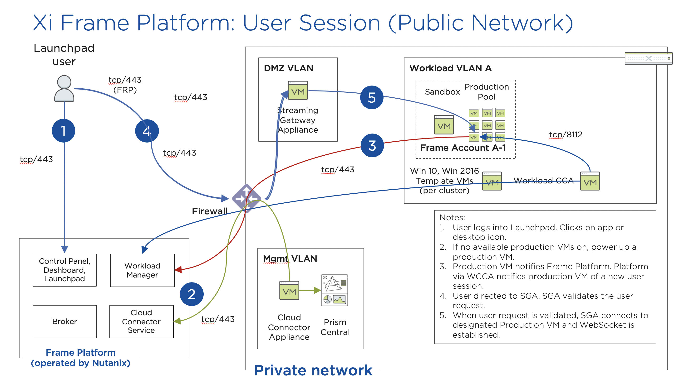

.. _framemanage:

--------------------------
Managing Xi Frame Desktops
--------------------------

Now that you have registered and associated your AHV cluster to your customer entity, you can now create your first Frame account using your AHV cluster resources. What’s in a Frame account? A Frame account consists of, at a minimum:

- Sandbox VM which is used to manage the gold master image for the account. The Sandbox image is a copy of the template image you brought during the CCA creation workflow.
- One or more pools of “production” VMs, based on the instance types you defined when you added the CCA to Frame. These production pool VMs will be used by end users to access their virtualized desktops or published applications.

**In this lab you will walk through configuring a Frame account, including configuring capacity, Launchpads, user management, and other administrative controls. After testing your initial published desktop, you will explore how updates can be applied and rolled out through Frame.**

Deploying a Desktop Pool
++++++++++++++++++++++++

#. From the **Xi Frame** portal, select **Accounts** from the left hand menu and click **Add Account**.

#. Under **Region and Network**, fill out the following fields and click **Next**:

   - **Name** - *Initials*\ -W10NP
   - **URL name** - (Default, based on Name)
   - **Cloud Provider** - Nutanix
   - **Region** - *The Cloud Account Name previously configured through the CCA*

   .. figure:: images/1b.png

#. Under **Configuration**, note the available options correspond to your CCA selections. Choose an **Instance Type** and increase the slider value to provide more storage capacity to the VMs. Do **NOT** select **Persistent desktop**. Click **Next**.

   .. figure:: images/2.png

   .. note::

     *If each user sessions utilizes a dedicated VM, as in traditional VDI (rather than a shared model like RDS or XenApp), why does Frame use Windows Server OS images?*

     Historically, due to Microsoft Windows licensing restrictions, AWS and Azure provide Windows Server OS images. The Windows Server images are presented with a familiar Windows desktop UI, and generally support all of the same applications.

     Microsoft has made some adjustments in their Windows licensing so Xi Frame is able to support Windows 10 on Azure and Nutanix AHV. Customers must bring their own Microsoft VDA licenses for Windows 10.

#. Click **Create** to begin provisioning the pool based on your selections, including a Sandbox VM.

   Your Sandbox is a special instance that serves as the basis for creating all of your production instances. Its disk is often called a “Gold Master” or “Master Image.” When you launch the Sandbox desktop, you have full admin access to install new apps or apply system updates.

#. From the **Accounts** page, select the previously created account to view the **Summary** dashboard.

   .. figure:: images/4.png

   In the following exercises we'll complete configuration of this pool of Xi Frame resources, exploring more of the Xi Frame administrative portal.

Configuring Capacity
++++++++++++++++++++

#. Click **Capacity** in the sidebar.

   Frame provides considerable flexibility to define the minimum and maximum number of available desktops, allowing administrators to balance cost and instant availability. Capacity can also be configured on a per Instance Type basis.

#. Hover over the :fa:`info-circle` icons to understand the different controls available.

   As each VM supports 1 concurrent user in Frame, the number of concurrent users supported by a production pool should equal the **Max number of instances**.

#. On the **AHV 2vCPU 4GB** tab, increase the **Buffer instances** to **1** and **Max number of instances** to **3**. Click **Save > Confirm**.

   .. figure:: images/5.png

   Increasing **Buffer instances** to 1 directs Frame to have at least one VM powered on and available for the next user. As each user connects into a Frame session, Frame will power on the next VM to maintain **Buffer instances** = 1 (until the **Max number of instances** of 3 is reached).

   .. note::

     For Cloud hosted desktops, each VM that is powered on results in a VM charge by AWS, Azure or GCP, regardless of whether the VM is being used. Unless there are justifiable reasons, the **Minimum number of instances** powered on and **Buffer instances** values should be set to 0 for Default capacity. If these two parameters are greater than 0, then AWS, Azure, and GCP will charge for those powered on VMs.

#. Click **Save**.

#. Under **Active capacity**, observe you can configure separate capacity policy to accommodate usage during peak periods (e.g. weekdays vs. weekends). **Leave the default selections.**

   .. figure:: images/6.png

#. Once you have configured capacity for your pool, the template or "Gold Image" can be published, allowing desktop VMs to be created. Select **Sandbox** from the sidebar and click **Publish > Publish**.

   .. figure:: images/6b.png

   Publishing typically takes ~15 minutes or more, depending on the number of VMs that need to be provisioned with the Sandbox image. When the Account Administrator publishes the Sandbox, Frame Platform will backup the Sandbox image and prepare the image. Next, Frame Platform will provision VMs in a shadow pool using the new image. The max capacity value for a given production pool determines the number of VMs provisioned.

   .. During this process you will still be able to connect to and use your original production pool – *zero end-user downtime!* If a user was connected to a session when you initiated a publish, they could continue to work, uninterrupted. Once a user closes (not just disconnect) their session, the instance will be terminated and replaced with a VM from the shadow pool.

   Each time you publish an updated version of your Sandbox image, Frame will automatically create a backup, allowing you to easily and rapidly roll back your production environment if necessary.

#. While the initial template is published, continue to explore the Xi Frame administrative portal below.

Configuring Launchpads
++++++++++++++++++++++

The Launchpad is the end user-facing part of the Xi Frame platform interface where users have access to their published applications or desktops, as authorized by their Account Administrator. Each Launchpad is associated with a Frame account and dictates:

- Whether the Launchpad provides access to published applications (Application Launchpad) or a desktop (Desktop Launchpad)
- The instance types that are allowed to be used with the Launchpad
- Session settings for governing availability of one or more cloud storage providers, session timeouts, ability to copy/paste (bidirectionally or unidirectionally), print, download/upload files, Quality of Service (QoS) parameters governing the Frame Remoting Protocol, etc.

Additionally, the Account Administrator can use Role-Based Access Control (RBAC) to determine which end users or groups of end users have access to which Launchpad(s), thereby controlling what published applications or desktops are allowed, on which instance types, and under what session settings.

#. Select **Launchpads** from the sidebar. Click **Add Launchpad**.

#. Keeping the default values, click **Add Launchpad** to create a Launchpad for running seamless applications.

   .. figure:: images/7.png

#. Under **Applications**, click **Add all applications** to publish all detected applications within your template image.

   .. figure:: images/8.png

#. Optionally, click **Manage Applications** and use the toggle switches to add or remove applications on your Launchpad.

   .. figure:: images/9.png

   Application icons can be dragged around to re-order how they will appear to end users, or dragged on top of one another (similar to a mobile phone OS) to create folders for grouping apps within the Launchpad.

   .. note::

      Note the **AHV 4vCPU 6GB** toggle under **Instance Pools**. When multiple types are available, Launchpads can be enabled or disabled on a per Instance Type basis. This is used in two ways:

      - When you want to restrict a user to a certain Instance Type (typically due to cost control), as users are assigned to Launchpads, and not specific Instance Pools.

      - When you want to make certain apps, such as a high end 3D drafting application, available to only a particular Instance Type, such as a high performance, GPU accelerated VM.

#. After you've finished making any customizations to your Launchpad, click **Save**.

----------------------------------------------------------------

#. Click **+ Add Launchpad** to add a **Desktop** launchpad with a customized name and URL slug. Click **Add Launchpad**.

   .. figure:: images/10.png

   Note that there are no individual applications to select, as this Launchpad will provide a single icon to launch a full desktop session.

#. Select an alternate background image (or upload your own) to visually differentiate the two Launchpads.

   If Account Administrators wish to deliver individual applications (common when supporting task work or delivering applications into an existing desktop environment such as a corporate laptop), then an application Launchpad is appropriate. For user groups that are more comfortable with a desktop (even if it is non-persistent session and user data and files need to be persisted in a file server or cloud storage), then the Account Administrator can offer a Desktop Launchpad.

Exploring Settings
++++++++++++++++++

#. Click **Settings** in the sidebar and select the **Session** tab.

   The **Session** tab allows an administrator to adjust the default session behavior for all Launchpads.

   .. note::

     Session settings can also be customized on a per Launchpad basis, or as previously seen, directly by the end user if allowed.

     .. figure:: images/11.png

   You can choose to give your users access to cloud storage, toggle various features such as upload/download, configure session time limits, and even customize session QoS settings in the **Network** section.

#. Enable all **Storage** options and click **Save**.

   .. figure:: images/12.png

Adding Users
++++++++++++

While you can access applications and desktops using your administrative Frame account, adding new users is fast and simple.

#. From the toolbar, click your **Customer** name (e.g. **nutanix.com-####**).

   .. figure:: images/13.png

#. Click :fa:`ellipsis-v` **> Users**

   .. figure:: images/14.png

#. Enable the **Basic (username/password)** authentication provider and click **Save**.

   .. figure:: images/15.png

   Frame supports several authentication mechanisms.

   For most enterprises who have an identity provider (IdP) such as Okta, Ping, Azure AD, ADFS, we recommend the SAML2 integration. For enterprises who use Google Sign-In, Frame integrates with Google Identity via OAuth2.

   For customers who do not have an IdP, Frame provides a native identity provider, allowing an administrator to create and control local e-mail address based accounts.

   .. note::

      The Frame Basic identity provider is not intended to be used as an enterprise identity provider. It has no support for configurable password strength policies, multi-factor authentication, or ability to aggregate users into groups. It is meant only for customers who need a simple IdP for testing. Nutanix highly recommends customers integrate an enterprise-grade identity provider.

   Because Frame is a Platform as a Service, there are both Javascript and Web Services APIs for enterprises and partners used to embed Frame into their own web applications. In the case of Web Services APIs, the API mechanism is used to generate API keys to authenticate to the Frame API endpoints.

   Additionally, providers can be enabled/configured on a per customer, organization, or account (pool) basis.

#. Select the **Basic (username/password)** tab and click **Invite Users**.

#. Enter your business or personal e-mail address and add **Launchpad User** roles for each of the Launchpads you have created.

   .. figure:: images/16.png

#. Click **Invite**.

#. Select the **MyNutanix** tab and click **+ Add** under **User Access** to allow users with My Nutanix accounts to access each of the Launchpads you have created. Click **Save**.

   .. figure:: images/17.png

   With just a few clicks, you've enabled users from multiple IDPs access to your pool of Xi Frame resources.

Testing End User Experience
+++++++++++++++++++++++++++

In this exercise, you will connect to your Frame desktop as an end user. The diagram below illustrates the typical network topology for a user connecting to a Frame desktop running in a Nutanix Private Cloud. In this environment you are connecting via a LAN connection, so the optional Streaming Gateway Appliance is not used.

#. From the sidebar, select **Accounts >** *Initials*\ **-W10NP** to return to managing your pool.

   By now your image should have finished publishing. You can verify this in a number of ways. On the **Summary** page, you should now see **1 Active Instance** under **Status** due to the buffer capacity configuration.

#. Click **Sandbox** and note the Sandbox now lists a **Last published on...** timestamp, and a snapshot of the image is available under **Backups**.

#. Click **Status** in the sidebar and note there are 3 **Production** VMs provisioned, with 1 in a **Running** state. Note the **Workload ID** corresponds to the **frame-instance-prod-...** VM name in Prism.

   .. figure:: images/18.png

   .. note::

      Try selecting one of the **frame-instance-prod-...** VMs in Prism Central and viewing the assigned categories. What additional categories and values have automatically been generated within the cluster by the CCA?

#. From the toolbar, select your name in the upper right hand drop down menu and click **Logout**.

#. To log back into the environment as a user, open your **You’ve been invited to join Nutanix Frame** e-mail. Launch the **Get Started** link and provide your name and a password.

   .. figure:: images/19.png

#. You should be presented by your **Application Launchpad**.

#. Note the status bar at the bottom at the bottom of the Launchpad.

   .. figure:: images/20.png

   The **AHV 2vCPU 4GB** denotes the **Instance Type**. Note that if you select the **AHV 4vCPU 6GB** profile, the application resources are unavailable, as no capacity was configured for this Instance Type.

#. Click on **Google Chrome** to launch your first Frame session.

   .. figure:: images/21.png

   You will be launching Google Chrome in “application mode,” as opposed to full desktop delivery.

   The session should begin almost instantly, as the environment has been configured to pre-boot a minimum of 1 VM, and maintain an available buffer of 1 VM. Without this configuration, the initial session could take ~2 minutes to launch, as the VM resources would have to be booted on demand once the user clicked the application in the Launchpad.

   Once your browser is connected into your Frame session, you will see Chrome within your browser. Notice that you can resize the Chrome window and maximize the Chrome application to occupy the entire browser tab. However, there is no underlying desktop visible.

   Note the changes to the status bar that appears at the bottom of your local browser window.

   .. figure:: images/22.png

#. Click the :fa:`gear` icon on the status bar to explore the actions available to a user during the session, such as launching and switching to other applications and network QoS settings.

#. Click :fa:`gear` **> Show/hide stats** to show bandwidth utilization in the status bar. Click **Session stats** to view expanded statistics.

   .. figure:: images/30.png

   Note that when the display is not changing, the Frame Remoting Protocol will adapt and drop the frame rate to 0. Consumed bandwidth will fall to 1 kbps.

#. Begin playing a YouTube video with the highest available quality and note bandwidth consumption. Note the consumed bandwidth.

#. Click :fa:`gear` **> Settings** and reduce **Max frame rate** and **Max videobit rate** to their lowest values. These settings can be controlled by an administrator to help balance experience and bandwidth consumption.

#. Hover over the remaining elements in the status bar to see what they do.

#. Click :fa:`gear` **> Disconnect** to return to the Launchpad without ending the session.

#. Click the icon at the top of the Launchpad to switch to the **Desktop** Launchpad. Launch the **Desktop** and note you are connected to the same VM session, with Chrome still running.

   .. figure:: images/23.png

#. In **Prism Central**, note that an additional **frame-instance-prod-...** VM has been powered on to maintain the 1 VM buffer policy.

Adding New Applications
+++++++++++++++++++++++

Frame makes it very simple to customize your "Gold" image and add new applications.

#. Leave your connection to your Frame desktop running. Open https://frame.nutanix.com in a new browser tab and **Log off** of the user account.

#. When prompted, click **Sign in with My Nutanix** and provide your My Nutanix credentials. From your username drop down menu, click **Go to Dashboard** to access the Xi Frame administrator portal.

   .. figure:: images/24.png

#. Select **Sandbox** from the sidebar and click **Power on** to boot the Sandbox VM.

#. When the **Status** changes to **Running**, click **Start session** to launch the connection to your Sandbox VM.

   .. figure:: images/25.png

#. Download an application installer to the Sandbox desktop (the example below uses the `PuTTY <https://www.chiark.greenend.org.uk/~sgtatham/putty/latest.html>`_) and install the new application. For many applications, Frame will recognize that you just installed an application and ask you if you wish to onboard the application (for application delivery). If prompted, click **OK** to automatically onboard the applications into Frame.

   .. figure:: images/26.png

   .. note::

      Alternatively, you can simply right-click the application icon and select **Onboard to Frame**.

      .. figure:: images/27.png

      If an administrator plans to deliver a desktop, they simply install the applications in the Sandbox and do not have to onboard.

#. Click :fa:`gear` **> Disconnect** to return to the Dashboard.

   Your newly onboarded app(s) will appear under **Applications**, which you can hover over to edit properties or remove the application. Deleting the application in the Dashboard, referred to as offboarding, will not remove it from your image, but will remove it from your Launchpad(s).

#. Optionally, remove any unwanted applications from the Dashboard (e.g. Notepad).

   .. figure:: images/28.png

   .. note::

     If a user has access to the full desktop via a Launchpad, they will be able to access all applications within the image, regardless of whether or not they have been onboarded and published as individual apps.

   Next we will publish our changes to the Sandbox image to allow users to access the new applications.

#. Under **Sandbox**, click :fa:`ellipsis-v` **> Close Session** to end the active Sandbox session.

#. Click **Publish > Publish** to roll out your updated image.

   As a reminder, publishing typically takes ~15 minutes. During this process you will still be able to connect to and use your original production pool – *zero end-user downtime!* If a user was connected to a session when you initiated a publish, they could continue to work, uninterrupted. Once a user closes (not just disconnect) their session, the instance will be terminated and replaced with a VM from the shadow pool.

#. Select **Launchpads** from the sidebar and click **Manage Applications**. Enable the new applications you've added to your golden image and click **Save**.

   .. figure:: images/29.png

#. Once the updated image has been published, return to your user Desktop session and click :fa:`gear` **> Close Session > Close Session** to terminate the session. Return to the **Applications** Launchpad and launch one of your new applications.

   .. note::

      This session may take slightly longer to start, as VM resources may not yet be pre-booted according to the Capacity configuration. You can verify this on the **Status** page in the **Xi Frame** portal.

   In minutes you've rolled out an updated image to your resource pool, without interrupting on-going sessions.
